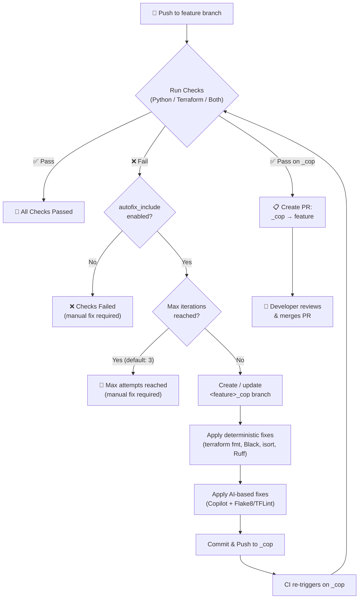

# github-workflows

<!-- LOGO -->
<a href="https://acai.gmbh">    
  
</a>

<!-- SHIELDS -->
[![Maintained by acai.gmbh][acai-shield]][acai-url]

<!-- DESCRIPTION -->
**GitHub Workflows for ACAI Terraform modules (with Python support)**

This repository provides reusable [GitHub Workflows][github_workflows_link] designed for ACAI Terraform modules, including integrated Python support. The workflows automate static code analysis, formatting, documentation checks, linting, and security scanning directly in GitHub Actions. 

## Copilot Autofix (_cop Branch Strategy)

All check workflows (`checks-py-module`, `checks-tf-module`, `checks-py-tf-module`) support an optional **Copilot Autofix** feature that automatically fixes code findings on a dedicated `_cop` branch.

### How it works



### Key features

| Feature | Description |
|---------|-------------|
| **Iterative fixing** | Fixes are applied iteratively until checks pass (up to `max_copilot_attempts`) |
| **No auto-merge** | A PR is created instead — developer reviews and merges manually |
| **Generic** | Works for Python, Terraform, or both combined |
| **Deterministic first** | Runs safe, deterministic tools before AI-based fixes |
| **Branch isolation** | All fixes happen on `<feature>_cop`, never on the feature branch |

### Enabling Autofix

Pass `autofix_include: true` in your consumer workflow and add `**_cop` to the push branch filter:

```yaml
on:
  push:
    branches: [main, '**_cop']
  pull_request:
    branches: [main]

jobs:
  checks:
    uses: acai-solutions/github-workflows/.github/workflows/checks-py-module.yml@main
    with:
      autofix_include: true
    secrets: inherit
```

### Reusable Workflows

| Workflow | Fix Types | Description |
|----------|-----------|-------------|
| `copilot-autofix.yml` | Python, Terraform | Generic autofix with `fix_python` / `fix_terraform` inputs |
| `checks-py-module.yml` | Python | Python checks + optional autofix |
| `checks-tf-module.yml` | Terraform | Terraform checks + optional autofix |
| `checks-py-tf-module.yml` | Python + Terraform | Combined checks + optional autofix |

## Referenced Github Actions

The reusable Github Workflows utilize the following external GitHub Actions:

**Core Actions:**
- [`actions/checkout`](https://github.com/actions/checkout) - Repository checkout functionality
- [`actions/upload-artifact`](https://github.com/actions/upload-artifact) - Artifact upload and storage
- [`actions/setup-go`](https://github.com/actions/setup-go) - Go environment configuration
- [`actions/setup-python`](https://github.com/actions/setup-python) - Python runtime setup
- [`actions/github-script`](https://github.com/actions/github-script) - Run JavaScript code within workflows
- [`ad-m/github-push-action`](https://github.com/ad-m/github-push-action) - Commit and push changes back to the repository from within workflows
- [`github/codeql-action/upload-sarif`](https://github.com/codeql-action/upload-sarif) - Upload Sarif

**Terraform & Infrastructure:**
- [`hashicorp/setup-terraform`](https://github.com/hashicorp/setup-terraform) - Terraform CLI installation
- [`terraform-docs/gh-actions`](https://github.com/terraform-docs/gh-actions) - Documentation generation
- [`terraform-linters/setup-tflint`](https://github.com/terraform-linters/setup-tflint) - Installs and configures TFLint for Terraform code analysis

**Code Quality & Security:**
- [`reviewdog/action-trivy`](https://github.com/marketplace/actions/run-trivy-with-reviewdog) - Run trivy with reviewdog
- [`aquasecurity/trivy-action`](https://github.com/marketplace/actions/aqua-security-trivy) - Standalone Trivy security scanning for vulnerabilities
- [`bridgecrewio/checkov-action`](https://github.com/bridgecrewio/checkov-action) - Infrastructure as Code (IaC) static analysis and security scanning
- [`mikepenz/action-junit-report`](https://github.com/mikepenz/action-junit-report) - Converts test results to JUnit format and publishes them as workflow artifacts


<!-- AUTHORS -->
## Authors

This module is maintained by [ACAI GmbH][acai-url].

<!-- LICENSE -->
## License

This repository is licensed under AGPL v3
<br />
See [LICENSE][license-url] for full details.

<!-- COPYRIGHT -->
<br />
<br />
<p align="center">Copyright &copy; 2025 ACAI GmbH</p>

<!-- MARKDOWN LINKS & IMAGES -->
[acai-shield]: https://img.shields.io/badge/maintained_by-acai.gmbh-CB224B?style=flat
[acai-url]: https://acai.gmbh
[license-url]: https://github.com/acai-solutions/github-workflows/tree/main/LICENSE
[github_workflows_link]: https://docs.github.com/en/actions/learn-github-actions/workflow-syntax-for-github-actions
