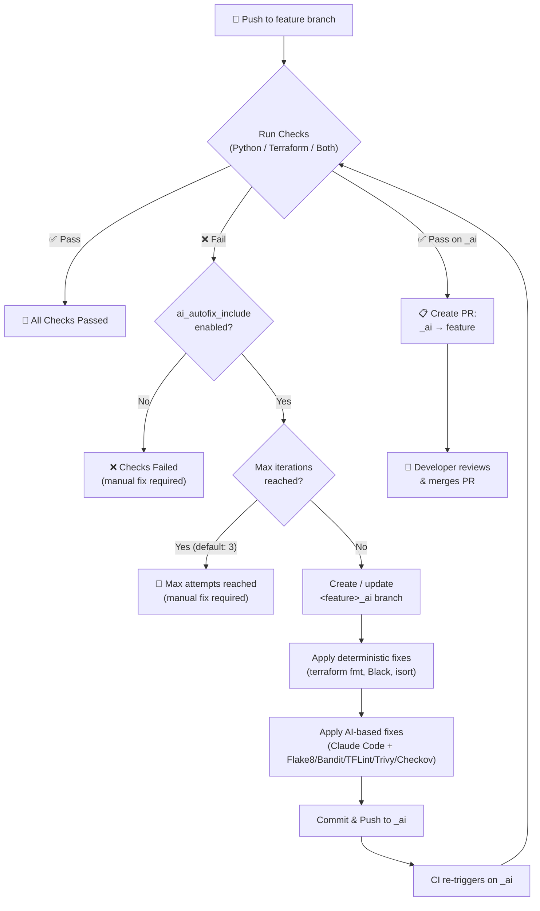

# github-workflows

<!-- LOGO -->
<a href="https://acai.gmbh">    
  
</a>

<!-- SHIELDS -->
[![Maintained by acai.gmbh][acai-shield]][acai-url]

<!-- DESCRIPTION -->
**GitHub Workflows for ACAI Terraform modules (with Python support)**

This repository provides reusable [GitHub Workflows][github_workflows_link] designed for ACAI Terraform modules, including integrated Python support. The workflows automate static code analysis, formatting, documentation checks, linting, security scanning, testing, and releasing directly in GitHub Actions.

## Workflow Overview

### Check Workflows (entry points)

| Workflow | Description |
|----------|-------------|
| `checks-py-module.yml` | Python checks: quality (Black, isort, Flake8, Bandit), tests (pytest), and optional AI autofix |
| `checks-tf-module.yml` | Terraform checks: format, docs, security (TFLint, Trivy, Checkov), Terratest, and optional AI autofix |
| `checks-py-tf-module.yml` | Combined Python + Terraform checks (runs `checks-py-module` then `checks-tf-module`) |

### Building-Block Workflows (called by check workflows)

| Workflow | Description |
|----------|-------------|
| `python-base.yml` | Python quality pipeline — Black formatting, isort, Flake8 linting, Bandit security scan |
| `python-test.yml` | Pytest matrix — runs tests per module in parallel with coverage |
| `tf-base.yml` | Terraform base pipeline — `terraform fmt` and `terraform-docs` generation |
| `tf-security.yml` | Terraform security pipeline — TFLint, Trivy (reviewdog on PRs / SARIF on push), Checkov |
| `tf-module-test.yml` | Terratest pipeline — matrix-based integration tests with AWS OIDC authentication |
| `tf-module-release.yml` | Semantic release pipeline — automated versioning and changelog generation |

### AI Autofix Workflows

| Workflow | Description |
|----------|-------------|
| `ai-autofix-python.yml` | Auto-fixes Python findings on a dedicated `_ai` branch using Claude Code |
| `ai-autofix-terraform.yml` | Auto-fixes Terraform findings on a dedicated `_ai` branch using Claude Code |
| `ai-autofix-create-ai-pr.yml` | Creates a PR from `*_ai` → feature branch when all checks pass |

## AI Autofix (_ai Branch Strategy)

All check workflows (`checks-py-module`, `checks-tf-module`, `checks-py-tf-module`) support an optional **AI Autofix** feature powered by [Claude Code](https://github.com/anthropics/claude-code-action) that automatically fixes code findings on a dedicated `_ai` branch.

### How it works



### Key features

| Feature | Description |
|---------|-------------|
| **Iterative fixing** | Fixes are applied iteratively until checks pass (up to `max_attempts`, default: 3) |
| **No auto-merge** | A PR is created instead — developer reviews and merges manually |
| **Generic** | Works for Python, Terraform, or both combined |
| **Deterministic first** | Runs safe, deterministic tools (Black, isort, terraform fmt) before AI-based fixes |
| **Isolated Claude sessions** | Each tool (Flake8, Bandit, TFLint, Trivy, Checkov, Terratest) gets its own Claude session |
| **Branch isolation** | All fixes happen on `<feature>_ai`, never on the feature branch |

### Enabling AI Autofix

Pass `py_ai_autofix_include: true` and/or `tf_ai_autofix_include: true` in your consumer workflow and add `**_ai` to the push branch filter:

```yaml
on:
  push:
    branches: [main, '**_ai']
  pull_request:
    branches: [main]

jobs:
  checks:
    uses: acai-solutions/github-workflows/.github/workflows/checks-py-module.yml@main
    with:
      py_ai_autofix_include: true
    secrets: inherit
```

### Prerequisites for AI Autofix

| Secret | Required | Purpose |
|--------|----------|---------|
| `ANTHROPIC_API_KEY` | Yes | API key for Claude Code sessions |
| `GH_RELEASE_APP_ID` | Yes | GitHub App ID for creating PRs and pushing to `_ai` branches |
| `GH_RELEASE_APP_PRIVATE_KEY` | Yes | GitHub App private key |

## Referenced GitHub Actions

The reusable GitHub Workflows utilize the following external GitHub Actions:

**Core Actions:**
- [`actions/checkout`](https://github.com/actions/checkout) - Repository checkout functionality
- [`actions/upload-artifact`](https://github.com/actions/upload-artifact) - Artifact upload and storage
- [`actions/setup-go`](https://github.com/actions/setup-go) - Go environment configuration (for Terratest)
- [`actions/setup-python`](https://github.com/actions/setup-python) - Python runtime setup
- [`actions/setup-node`](https://github.com/actions/setup-node) - Node.js setup (for semantic-release)
- [`actions/github-script`](https://github.com/actions/github-script) - Run JavaScript code within workflows
- [`actions/create-github-app-token`](https://github.com/actions/create-github-app-token) - Generate GitHub App installation tokens
- [`ad-m/github-push-action`](https://github.com/ad-m/github-push-action) - Commit and push changes back to the repository from within workflows
- [`github/codeql-action/upload-sarif`](https://github.com/github/codeql-action) - Upload SARIF security results

**Terraform & Infrastructure:**
- [`hashicorp/setup-terraform`](https://github.com/hashicorp/setup-terraform) - Terraform CLI installation
- [`terraform-docs/gh-actions`](https://github.com/terraform-docs/gh-actions) - Documentation generation
- [`terraform-linters/setup-tflint`](https://github.com/terraform-linters/setup-tflint) - Installs and configures TFLint for Terraform code analysis
- [`aws-actions/configure-aws-credentials`](https://github.com/aws-actions/configure-aws-credentials) - AWS OIDC authentication for Terratest

**Code Quality & Security:**
- [`reviewdog/action-trivy`](https://github.com/marketplace/actions/run-trivy-with-reviewdog) - Run Trivy with reviewdog (PR annotations)
- [`aquasecurity/setup-trivy`](https://github.com/aquasecurity/setup-trivy) - Install Trivy CLI
- [`aquasecurity/trivy-action`](https://github.com/marketplace/actions/aqua-security-trivy) - Standalone Trivy security scanning for vulnerabilities (SARIF output)
- [`bridgecrewio/checkov-action`](https://github.com/bridgecrewio/checkov-action) - Infrastructure as Code (IaC) static analysis and security scanning
- [`mikepenz/action-junit-report`](https://github.com/mikepenz/action-junit-report) - Publishes JUnit test results as check runs

**AI Autofix:**
- [`anthropics/claude-code-action`](https://github.com/anthropics/claude-code-action) - Claude Code for AI-based code fixes


<!-- AUTHORS -->
## Authors

This module is maintained by [ACAI GmbH][acai-url].

<!-- LICENSE -->
## License

This repository is licensed under AGPL v3
<br />
See [LICENSE][license-url] for full details.

<!-- COPYRIGHT -->
<br />
<br />
<p align="center">Copyright &copy; 2026 ACAI GmbH</p>

<!-- MARKDOWN LINKS & IMAGES -->
[acai-shield]: https://img.shields.io/badge/maintained_by-acai.gmbh-CB224B?style=flat
[acai-url]: https://acai.gmbh
[license-url]: https://github.com/acai-solutions/github-workflows/tree/main/LICENSE
[github_workflows_link]: https://docs.github.com/en/actions/learn-github-actions/workflow-syntax-for-github-actions
