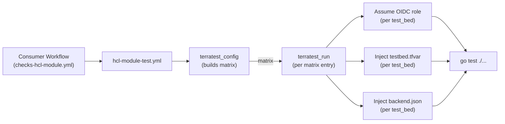

# Terratest Module Documentation

This document describes how the [`hcl-module-test.yml`](../.github/workflows/hcl-module-test.yml) reusable workflow runs Terratest against ACAI HCL modules and how the consuming repository must be configured.

## Overview

The Terratest pipeline is matrix-driven and supports executing the same test code against **multiple test beds**, **multiple HCL engines** (Terraform / OpenTofu) and **multiple provider versions** in parallel.



## Test Beds

A *test bed* is a target AWS environment in which Terratest deploys real infrastructure. The workflow currently supports two test beds out of the box:

| Test Bed   | Purpose                                                    |
|------------|------------------------------------------------------------|
| `AWS`      | Default ACAI test bed (commercial partition).              |
| `AWS_ESC`  | ACAI Extended Support / commercial fallback test bed.      |

Test beds are selected per pipeline run via the `hcl_test_beds` input (JSON array):

```yaml
with:
  hcl_test_beds: '["AWS", "AWS_ESC"]'
  hcl_test_bed_aws_terratest_configs:     '["aws/matrix_tf1x5x7_aws6x0x0.json", "aws/matrix_ofu1x6x0_aws6x0x0.json"]'
  hcl_test_bed_aws_esc_terratest_configs: '["aws/matrix_tf1x14x0_aws6x29x0.json", "aws/matrix_ofu1x9x0_aws6x29x0_only.json"]'
```

For each entry in `hcl_test_beds`, the workflow expands the corresponding matrix configs and tags each entry with `test_bed = AWS` or `test_bed = AWS_ESC`.

## Required GitHub Configuration

Backend, account and region configuration are **injected from GitHub repository variables and secrets** based on the `test_bed` of the matrix entry. The naming convention is:

```
<TEST_BED>_TESTBED_<PURPOSE>
```

So the `AWS` test bed reads `AWS_TESTBED_*` and the `AWS_ESC` test bed reads `AWS_ESC_TESTBED_*`.

### Repository Variables (`vars.*`)

Configured under **Settings → Secrets and variables → Actions → Variables**.

| Variable                       | Test Bed   | Required | Description                                                                                       |
|--------------------------------|------------|----------|---------------------------------------------------------------------------------------------------|
| `AWS_TESTBED_AWS_REGION`       | `AWS`      | Yes      | AWS region used for the OIDC AssumeRole call and for STS endpoint resolution.                     |
| `AWS_TESTBED_TFVARS`           | `AWS`      | Yes      | Multi-line `*.tfvars` content. Written to `<terratest_path>/testbed.tfvar` and applied to all `plan/apply/destroy` runs via `TF_CLI_ARGS_*`. |
| `AWS_TESTBED_BACKEND_JSON`     | `AWS`      | Yes      | JSON object with the partial S3 backend configuration. Written to `<terratest_path>/backend.json` and consumed by `loadBackendConfig()`. |
| `AWS_ESC_TESTBED_AWS_REGION`   | `AWS_ESC`  | If used  | Same as above, for the AWS-ESC test bed.                                                          |
| `AWS_ESC_TESTBED_TFVARS`       | `AWS_ESC`  | If used  | Same as above, for the AWS-ESC test bed.                                                          |
| `AWS_ESC_TESTBED_BACKEND_JSON` | `AWS_ESC`  | If used  | Same as above, for the AWS-ESC test bed.                                                          |

### Repository Secrets (`secrets.*`)

| Secret                            | Test Bed   | Required | Description                                                                 |
|-----------------------------------|------------|----------|-----------------------------------------------------------------------------|
| `AWS_TESTBED_OIDC_ROLE_ARN`       | `AWS`      | Yes      | IAM Role ARN assumed via GitHub OIDC for the `AWS` test bed.                |
| `AWS_ESC_TESTBED_OIDC_ROLE_ARN`   | `AWS_ESC`  | If used  | IAM Role ARN assumed via GitHub OIDC for the `AWS_ESC` test bed.            |
| `GH_REPO_READ_APP_ID`             | both       | Yes      | GitHub App ID used to read the public matrix config repo.                   |
| `GH_REPO_READ_APP_PRIVATE_KEY`    | both       | Yes      | GitHub App private key.                                                     |

### Example `AWS_TESTBED_BACKEND_JSON`

```json
{
  "bucket":         "acai-tfstate-aws-testbed",
  "region":         "eu-central-1",
  "dynamodb_table": "acai-tfstate-lock"
}
```

The Go helper sets the `key` per test (see [`helpers_test.go`](../sample-terraform-module/tests/terratest/helpers_test.go)).

### Example `AWS_TESTBED_TFVARS`

```hcl
account_ids = {
  org_mgmt      = "111111111111"
  core_logging  = "222222222222"
  core_security = "333333333333"
  core_backup   = "444444444444"
  workload      = "555555555555"
}
aws_region = "eu-central-1"
```

## Matrix Config Files

Matrix configs live in the public repo [`acai-solutions/github-workflow-configs`](https://github.com/acai-solutions/github-workflow-configs) under `hcl/terratest/aws/`. Each file describes one or more `(hcl_engine, hcl_engine_version, provider_version)` combinations:

```json
{
  "include": [
    {
      "hcl_engine_version": "= 1.5.7",
      "hcl_engine":         "terraform",
      "provider_version": { "hashicorp/aws": "5.80.0" }
    },
    {
      "hcl_engine_version": ">= 1.6",
      "hcl_engine":         "terraform",
      "provider_version": { "hashicorp/aws": "6.X.X" }
    }
  ]
}
```

The `X` placeholder resolves to the latest matching version from the registry at runtime.

The full matrix is the cartesian product of `hcl_test_beds` × `hcl_test_bed_<bed>_terratest_configs` × `include[]`.

## Test Layout in the Module Repo

The workflow expects the following layout in the consuming module repository (mirrored 1:1 by the [`sample-terraform-module/`](../sample-terraform-module) reference):

```
<module-root>/
├── main.tf / variables.tf / outputs.tf   # the module under test
├── examples/                              # default: inputs.hcl_terratest_examples_path = "examples"
│   └── complete/
│       ├── backend.tf                     # partial backend (see below)
│       ├── provider.tf                    # all aws providers + aliases consumed by the module
│       ├── variables.tf                   # variables fed by testbed.tfvar
│       ├── main.tf                        # instantiates the module under test
│       └── outputs.tf                     # MUST expose at least one `test_success*` boolean output
└── tests/                                 # default: inputs.hcl_terratest_path = "tests/terratest"
    └── terratest/
        ├── complete_test.go               # from sample-terraform-module/tests/terratest/
        ├── helpers_test.go                # from sample-terraform-module/tests/terratest/
        ├── go.mod                         # generated by the workflow on first run
        └── go.sum                         # generated by the workflow on first run
```

If your repo uses different paths, override:

```yaml
with:
  hcl_terratest_path:          "tests/terratest"
  hcl_terratest_examples_path: "examples"
```

### `examples/<name>/` — anatomy of a test example

Each example folder is a self-contained, deployable Terraform root module that exercises one scenario of the module under test. The workflow runs `terraform init / apply / destroy` from inside this folder.

#### `backend.tf` — partial S3 backend

The example **must** declare an empty/partial backend so that Terratest can inject the backend configuration via `-backend-config=...` from `backend.json`:

```hcl
terraform {
  backend "s3" {}
}
```

Concrete values (`bucket`, `region`, `dynamodb_table`) come from `<TEST_BED>_TESTBED_BACKEND_JSON`; the per-test `key` is set in Go via `loadBackendConfig(t, stateKey)`.

#### `provider.tf` — providers + aliases

Declares all `aws` providers (and aliases) the module needs. The role ARNs and region are templated from variables that come from `<TEST_BED>_TESTBED_TFVARS`:

```hcl
provider "aws" {
  region = var.aws_region
  alias  = "org_mgmt"
}

provider "aws" {
  region = var.aws_region
  alias  = "core_logging"
  assume_role {
    role_arn = "arn:${var.aws_partition}:iam::${var.account_ids.core_logging}:role/${var.iam_role_name}"
  }
}
```

#### `variables.tf` — fed by `testbed.tfvar`

Variables that differ between test beds (account IDs, region, partition, role name, …) are declared here and supplied via `testbed.tfvar` (= `<TEST_BED>_TESTBED_TFVARS`):

```hcl
variable "account_ids" {
  type = object({
    org_mgmt      = string
    core_logging  = string
    core_security = string
    core_backup   = string
    workload      = string
  })
}

variable "aws_region"    { type = string  default = "eu-central-1" }
variable "aws_partition" { type = string  default = "aws" }
variable "iam_role_name" { type = string  default = "OrganizationAccountAccessRole" }
```

#### `main.tf` — module under test + required_providers

Pins `required_version` and `required_providers` (used to build `.terraform.lock.hcl` from the matrix `provider_version`) and instantiates the module under test:

```hcl
terraform {
  required_version = ">= 1.5.0"
  required_providers {
    aws = { source = "hashicorp/aws", version = ">= 6.0" }
  }
}

module "example_complete" {
  source = "../../"
  # ... module inputs ...
  providers = {
    aws.org_mgmt      = aws.org_mgmt
    aws.core_logging  = aws.core_logging
    aws.core_security = aws.core_security
    aws.core_backup   = aws.core_backup
    aws.workload      = aws.workload
  }
}
```

#### `outputs.tf` — assertion contract

The example expresses test assertions as Terraform outputs that evaluate to the **string** `"true"`. The Go test reads them via `outputClean` and asserts equality. Use `test_success` for a single assertion, or `test_success1`, `test_success2`, … for multiple:

```hcl
output "test_success1" {
  description = "Check if specific OU-Path exists."
  value       = module.example_complete.level_3_ous_details["/root/level1_unit1/.../"].name == "level1_unit1__level2_unit2__level3_unit1"
}

output "test_success2" {
  description = "Check if a specific OU path resolves to an ID."
  value       = lookup(module.example_complete.ou_paths_to_ou_id, "/root/WorkloadAccounts/BusinessUnit_1/Prod/", null) != null
}
```

> Booleans are rendered as the JSON literals `true` / `false`; the helpers strip the surrounding quotes, so the assertion in Go is always `assert.Equal(t, "true", ...)`.

### `tests/terratest/` — anatomy of the Go test

Two files copied from [`sample-terraform-module/tests/terratest/`](../sample-terraform-module/tests/terratest):

#### `helpers_test.go` (latest helpers)

| Helper                                    | Purpose                                                                                                       |
|-------------------------------------------|---------------------------------------------------------------------------------------------------------------|
| `loadBackendConfig(t, stateKey)`          | Reads `backend.json`, overrides `key` per test, returns `nil` (= local state) when the file is absent.        |
| `getHclBinary()`                          | Returns `"terraform"` or `"tofu"` based on `TERRATEST_TERRAFORM_BINARY` (set by the workflow per matrix entry). |
| `outputClean(t, opts, key)`               | `terraform output -json <key>` → string, with trailing deprecation warnings stripped before unmarshalling.    |
| `outputMapClean(t, opts, key)`            | Same, into `map[string]string`.                                                                               |
| `outputRawClean(t, opts, key)`            | Returns the trimmed raw JSON string for ad-hoc inspection.                                                    |

#### `complete_test.go` — minimal default

```go
func TestExampleComplete(t *testing.T) {
    terraformDir := "../../examples/complete"
    stateKey     := "terratest/example-complete.tfstate"
    backendConfig := loadBackendConfig(t, stateKey)

    opts := &terraform.Options{
        TerraformBinary: getHclBinary(),
        TerraformDir:    terraformDir,
        NoColor:         false,
        Lock:            true,
        BackendConfig:   backendConfig,
    }

    defer terraform.Destroy(t, opts)
    terraform.InitAndApply(t, opts)

    assert.Equal(t, "true", outputClean(t, opts, "test_success"),
        "The test_success output is not true")
}
```

#### Multi-stage variant (targeted apply)

When the example has prerequisites that must exist before the module under test is planned (e.g. an IAM role consumed by the module, or an SCP referenced from a `local`), split the apply into stages by using `Targets` on the same options. The destroy walk then runs in reverse order:

```go
prep := &terraform.Options{
    TerraformBinary: getHclBinary(),
    TerraformDir:    terraformDir,
    BackendConfig:   backendConfig,
    Targets: []string{
        "module.create_provisioner",
        "aws_organizations_policy.scp_example",
    },
}
terraform.InitAndApply(t, prep)
time.Sleep(10 * time.Second) // IAM role propagation

mod := &terraform.Options{
    TerraformBinary: getHclBinary(),
    TerraformDir:    terraformDir,
    BackendConfig:   backendConfig,
    Targets:         []string{"module.example_complete"},
}
terraform.InitAndApply(t, mod)

assert.Equal(t, "true", outputClean(t, mod, "test_success1"))

terraform.Destroy(t, mod)
terraform.Destroy(t, prep)
```

## Reference Module

A full end-to-end reference module lives under [`sample-terraform-module/`](../sample-terraform-module):

- [`main.tf`](../sample-terraform-module/main.tf), [`variables.tf`](../sample-terraform-module/variables.tf), [`outputs.tf`](../sample-terraform-module/outputs.tf) — the module under test.
- [`examples/complete/`](../sample-terraform-module/examples/complete) — reference example folder ([`backend.tf`](../sample-terraform-module/examples/complete/backend.tf), [`provider.tf`](../sample-terraform-module/examples/complete/provider.tf), [`variables.tf`](../sample-terraform-module/examples/complete/variables.tf), [`main.tf`](../sample-terraform-module/examples/complete/main.tf), [`outputs.tf`](../sample-terraform-module/examples/complete/outputs.tf)) wired for the workflow's backend / tfvars injection.
- [`tests/terratest/`](../sample-terraform-module/tests/terratest) — [`complete_test.go`](../sample-terraform-module/tests/terratest/complete_test.go) (minimal default test) and [`helpers_test.go`](../sample-terraform-module/tests/terratest/helpers_test.go) (latest helpers: `loadBackendConfig`, `getHclBinary`, `outputClean` / `outputMapClean` / `outputRawClean`).

Mirror the layout into your module repo as a starting point.

## How the Workflow Wires Everything Together

For each matrix entry the workflow:

1. Resolves the AWS region from `<test_bed>_TESTBED_AWS_REGION` and the matching STS endpoint (handles `aws-cn` and `us-gov-*` partitions).
2. Assumes `<test_bed>_TESTBED_OIDC_ROLE_ARN` via [`aws-actions/configure-aws-credentials@v6`](https://github.com/aws-actions/configure-aws-credentials).
3. Sets up Go 1.24 and either `terraform` or `tofu` in the requested version.
4. Generates a `.terraform.lock.hcl` per example folder using the matrix `provider_version` (resolving `X` placeholders against the appropriate registry).
5. Writes `<terratest_path>/testbed.tfvar` from `<test_bed>_TESTBED_TFVARS`.
6. Writes `<terratest_path>/backend.json` from `<test_bed>_TESTBED_BACKEND_JSON`.
7. Exports:
   - `TERRATEST_TERRAFORM_BINARY = tofu | terraform`
   - `TF_CLI_ARGS_plan / apply / destroy = -var-file=<workspace>/<terratest_path>/testbed.tfvar`
8. Runs `go test -v -timeout 60m`, pipes through `terratest_log_parser` and renders a per-test summary in `$GITHUB_STEP_SUMMARY`.

## Minimal Consumer Workflow

```yaml
name: ACAI TERRAFORM MODULE

on:
  workflow_dispatch:
  pull_request:
    branches: [main]
  push:
    branches: [main]

jobs:
  hcl_module_checks:
    uses: acai-solutions/github-workflows/.github/workflows/checks-hcl-module.yml@main
    if: ${{ github.event_name == 'pull_request' || endsWith(github.ref_name, '_ai') }}
    with:
      hcl_test_beds: '["AWS", "AWS_ESC"]'
      hcl_test_bed_aws_terratest_configs:     '["aws/matrix_tf1x5x7_aws6x0x0.json", "aws/matrix_ofu1x6x0_aws6x0x0.json"]'
      hcl_test_bed_aws_esc_terratest_configs: '["aws/matrix_tf1x14x0_aws6x29x0.json", "aws/matrix_ofu1x9x0_aws6x29x0_only.json"]'
    secrets: inherit
```

## Troubleshooting

| Symptom                                                                 | Likely cause                                                                                       |
|-------------------------------------------------------------------------|----------------------------------------------------------------------------------------------------|
| `❌ No AWS region configured for test bed AWS_ESC`                       | Missing `AWS_ESC_TESTBED_AWS_REGION` repository variable.                                          |
| `Failed to parse terraform output ... invalid character 'W'`            | Deprecation warning leaked into stdout — use the `outputClean` helpers instead of `terraform.Output`. |
| `Backend configuration changed`                                         | `backend.json` missing or `key` not set per-test — ensure `loadBackendConfig(t, stateKey)` is called. |
| OIDC `AssumeRoleWithWebIdentity: AccessDenied`                          | Role trust policy does not allow the repo / branch / environment, or wrong `*_OIDC_ROLE_ARN`.      |
| `terraform: command not found`                                          | Test invokes `terraform` directly instead of `getHclBinary()` — OpenTofu matrix entries will fail. |
